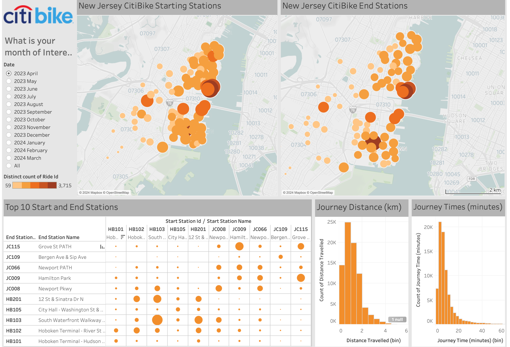

# Homework Assignment Tableau-Challenge

## Published Tableau Data
Click [here](https://public.tableau.com/views/citibike-challenge_17126973095390/Story1?:language=en-GB&publish=yes&:sid=&:display_count=n&:origin=viz_share_link) to view the Tableau project.

## Data Selection
For this homework assignment, I chose to use the last 12 months of data for the Jersey City Citi-Bike program. After some experimentation I found that the New York Citi-Bike dataset was too large for the Tableau Public licence to handle and only 1 months worth was able to be read. Therefore to gain some seasonal insights, I used the Jersey City dataset.

## Learnings from Map Building
### Station IDs
During the course of building the map, I found that there were two different naming conventions for Station ID's. It is apparent that the Jersey City station IDs are annotated by 2 letters followed by 3 digits e.g. HB103. Other stations outside the Jersey City jursidiction have a format of 4 digits followed by a decimal and then by two more digits e.g. 5532.01. I made a filter to help with this distinction using a regex expression.

Interestingly, there is sometimes a group of "stations" that have no station id. It is unclear what these stations mean - speculating that they could be grouped stations where bikes have not been returned back to a station or dumped (e.g. in the Hudson River)? These appear to occur in a grid pattern on the map. These stations have not been included in the dashboard analyses.

> **Important:** The remainder of the analysis will filter out the stations with null values and non-Jersey City stations.

It is recognised that sometimes riders are riding to or away from Jersey City and therefore have the aforementioned starting or ending numerical station ID.

It is observed that the majority of stations appear to cluster in zip codes that have a higher median income.

### Learnings from the total number of weekly rides with electric bikes vs classic
Citi Bike have introduced many more electric bikes in their fleet in 2024. This is clearly illustrated in the dramatic uptake in electric bike usage in 2024.

### Learnings from Monthly Statistics Dashboard
1. There is clear seasonality effects on the total monthly riders. Winter months have much significantly reduced number of riders compared to warmer seasons.
2. There is a clear effect on total number of riders during peak hours. The coloured table demonstrates peak bike usage during 6-8am and 5-6pm during weekdays. Weekends have a more usage during the middle of the day. Sunday is the least active day.    
3. The evening peak hours tends to be more busy than the morning peak hours. This is more pronounced amongst casual bike riders compared to member users. 
4. Weekends tend to have usage during the middle of the day. Interestingly, the early hours of Sunday morning is the busiest early morning period of the work, as party revellers are fairly active during this time.

### Learnings from the Station Data dashboard
1. The most common trip distance is between 0.5-1 km.
2. The most common trip time is between 2.5-5 minutes.
3. The most popular ride starting and destination stations are the Grove St PATH and Hoboken Terminal stations. The most popular western station is the Bergen and Sip Ave bike station. 

Points 1 and 2 illustrate that riders tend use Citi Bikes for short distances in Jersey City.
Point 3 reveal that riders will tend to use Citi Bikes for the entire round-trip in Jersey City.

